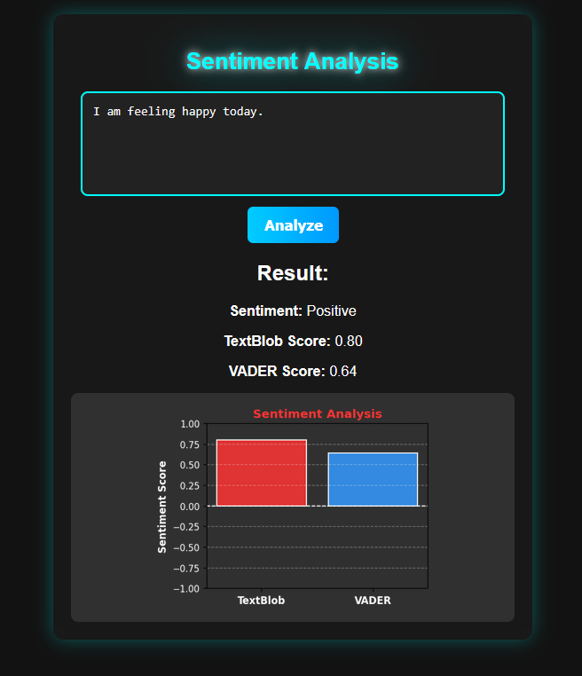

# Flask Sentiment Analysis

A simple web application that analyzes the sentiment of user-inputted text using Flask and visualizes the results with a graph.

# About the Project

This project is a Flask-based web application that performs sentiment analysis on user-inputted text. It determines whether the sentiment of the text is positive, negative, or neutral and represents the results graphically.
The application has a clean and modern user interface with a dark theme and interactive graph visualization.
It is useful for understanding the emotional tone of text and can be extended to analyze customer reviews, social media comments, or feedback.

• Real-time Sentiment Analysis using Natural Language Processing
• Flask Backend for API handling
• Interactive Graph for visualizing sentiment distribution
• Modern Dark-Themed UI
• Responsive and User-Friendly Design

